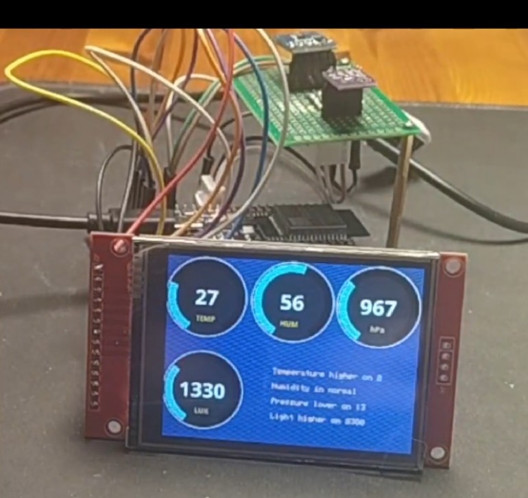
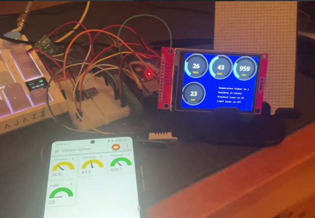

 

   
  <h1>Indoor climate monitoring system</h1>

An embedded system for monitoring indoor environmental conditions using an ESP32 microcontroller and multiple sensors.

The system collects environmental data such as temperature, humidity, atmospheric pressure and ambient light level, processes the measurements, and presents the results to the user through a display and a app using MQTT protocol.

## **Features**
- 🌡️ Temperature monitoring
- 💧 Relative humidity monitoring
- 🌬️ Atmospheric pressure measurement
- 💡 Ambient light measurement
- 📺 Real-time data display
- 📡 Real-time data transmission using the MQTT protocol
- 📊 Comparison of environmental parameters with predefined threshold values

## **Hardware**

- ESP32 WROOM 32D | main controller
- BME280 | atmospheric pressure
- DHT22 | Temperature and humidity
- BH1750 | Ambient light measurement
- ILI9341 | TFT display

## **Software**

- Iot MQTT Panel in Google Play/App Store
- Eclipse Mosquitto as a MQTT Broker for PC

## **Parameter Comparison Algorithm**

The parameter limits are defined based on technical documentation containing the applicable standards and reference values. Once a parameter value is entered into the designated field, the algorithm compares it with the predefined acceptable range and determines whether the measured value is within the normal limits.

If the value is within the normal range, the system indicates that the parameter is **🟢normal**. If the value is above or below the acceptable range, the system calculates the deviation from the corresponding limit and displays the result.

The application uses a similar approach for visual indication. If the parameter is within the normal range, the arc indicator is displayed in **green**. If a deviation is detected, the indicator changes to **🟡yellow** or **🔴red**, depending on the magnitude of the deviation.

  

